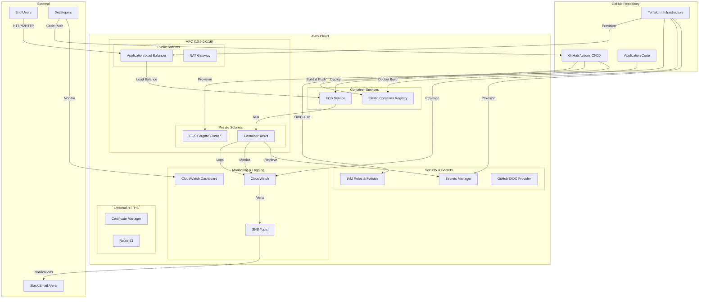
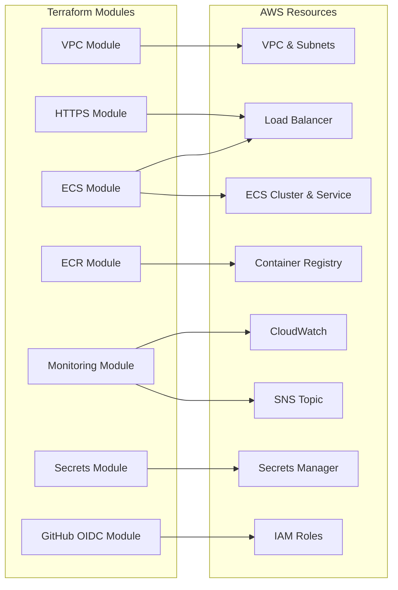
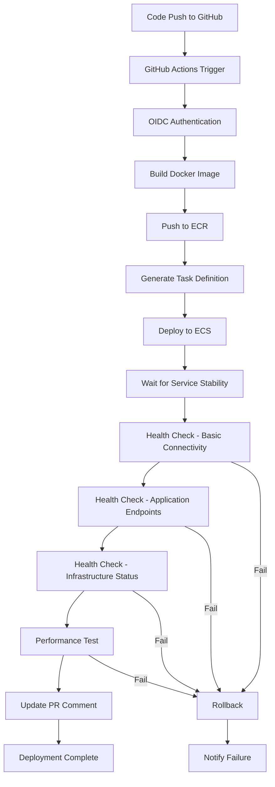
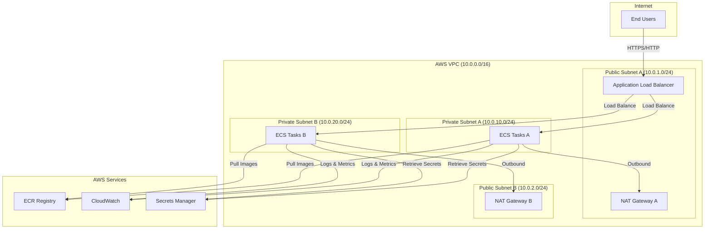
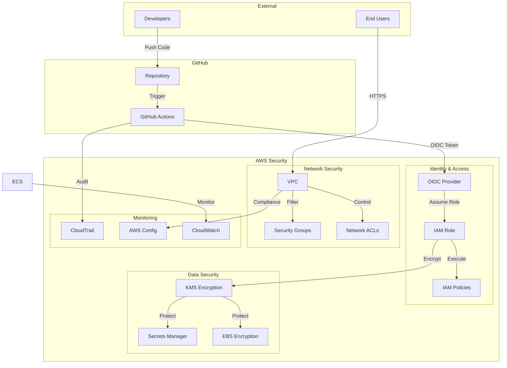
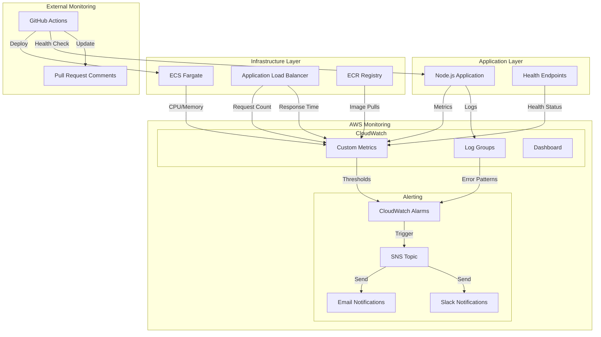
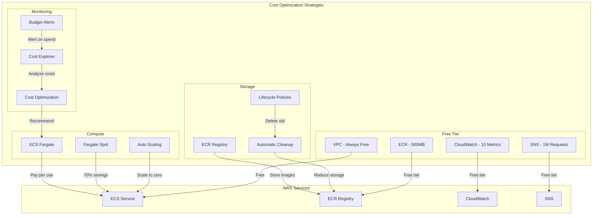
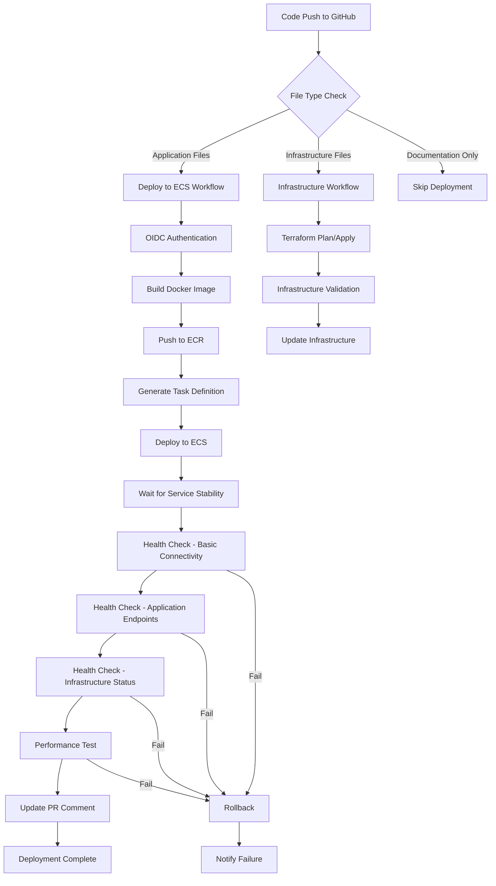
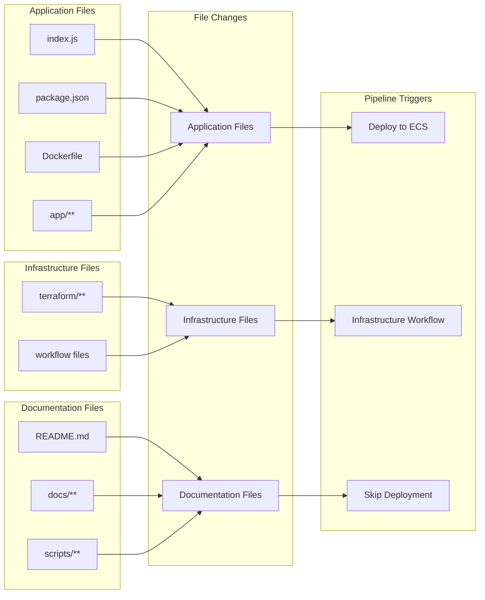

# Architecture Diagrams

This document contains Mermaid diagrams that can be rendered in GitHub, GitLab, or other Markdown viewers that support Mermaid.

## System Architecture Overview



## Infrastructure Components



## CI/CD Pipeline Flow



## Network Architecture



## Security Architecture



## Monitoring & Alerting Architecture



## Cost Optimization Architecture



### Optimized Pipeline Flow



### Pipeline Triggers



## How to Generate Visual Diagrams

### Option 1: GitHub/GitLab (Automatic)
- The diagrams above will render automatically in GitHub and GitLab
- Just view this file in the repository

### Option 2: Mermaid Live Editor
1. Go to [Mermaid Live Editor](https://mermaid.live/)
2. Copy any diagram code from above
3. Paste into the editor
4. Export as PNG, SVG, or PDF

### Option 3: VS Code Extension
1. Install "Mermaid Preview" extension
2. Open this file in VS Code
3. Use Command Palette: "Mermaid Preview"

### Option 4: Command Line
```bash
# Install Mermaid CLI
npm install -g @mermaid-js/mermaid-cli

# Generate PNG
mmdc -i architecture-diagrams.md -o architecture-diagrams.png

# Generate SVG
mmdc -i architecture-diagrams.md -o architecture-diagrams.svg
```

### Option 5: Online Tools
- [Mermaid Chart](https://www.mermaidchart.com/)
- [Draw.io](https://app.diagrams.net/) (import Mermaid)
- [Lucidchart](https://www.lucidchart.com/) (import Mermaid)
