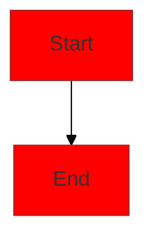
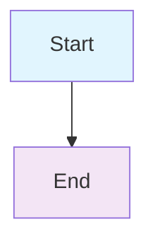
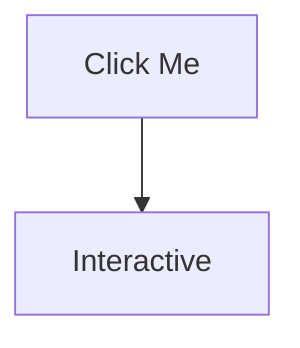
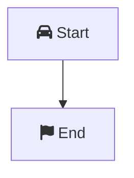
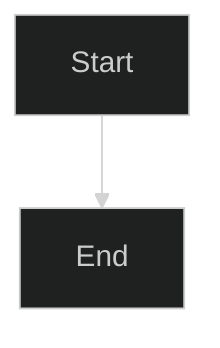

# Architecture Diagram Generation Guide

This guide provides multiple methods to generate visual architecture diagrams from the Mermaid code in this repository.

## 🎨 Available Diagrams

### 1. System Architecture Overview
- **File**: `docs/architecture-diagrams.md`
- **Purpose**: High-level system architecture showing all components
- **Complexity**: High - shows complete system flow

### 2. Infrastructure Components
- **File**: `docs/architecture-diagrams.md`
- **Purpose**: Terraform modules and AWS resources mapping
- **Complexity**: Medium - shows infrastructure relationships

### 3. CI/CD Pipeline Flow
- **File**: `docs/architecture-diagrams.md`
- **Purpose**: GitHub Actions deployment workflow
- **Complexity**: Medium - shows deployment process

### 4. Network Architecture
- **File**: `docs/architecture-diagrams.md`
- **Purpose**: VPC, subnets, and network security
- **Complexity**: High - shows network topology

### 5. Security Architecture
- **File**: `docs/architecture-diagrams.md`
- **Purpose**: Security controls and compliance
- **Complexity**: High - shows security layers

### 6. Monitoring & Alerting
- **File**: `docs/architecture-diagrams.md`
- **Purpose**: Observability and alerting flow
- **Complexity**: Medium - shows monitoring stack

### 7. Cost Optimization
- **File**: `docs/architecture-diagrams.md`
- **Purpose**: Cost optimization strategies
- **Complexity**: Medium - shows cost management

## 🛠️ Generation Methods

### Method 1: GitHub/GitLab (Automatic)
**Best for**: Quick viewing and sharing

1. **View in Repository**:
   - Navigate to `docs/architecture-diagrams.md`
   - Diagrams render automatically in GitHub/GitLab

2. **Copy Diagram Code**:
   - Click on any diagram
   - Copy the Mermaid code
   - Use in other tools

### Method 2: Mermaid Live Editor
**Best for**: Quick editing and testing

1. **Go to**: [Mermaid Live Editor](https://mermaid.live/)
2. **Copy Code**: From any diagram in `docs/architecture-diagrams.md`
3. **Paste**: Into the editor
4. **Export**: As PNG, SVG, or PDF
5. **Download**: High-quality images

### Method 3: VS Code Extension
**Best for**: Local development and editing

1. **Install Extension**:
   ```bash
   code --install-extension bierner.markdown-mermaid
   ```

2. **Open File**: `docs/architecture-diagrams.md`
3. **Preview**: Use Command Palette → "Markdown: Open Preview"
4. **Export**: Right-click diagram → "Save as Image"

### Method 4: Command Line (Mermaid CLI)
**Best for**: Automated generation and CI/CD

1. **Install Mermaid CLI**:
   ```bash
   npm install -g @mermaid-js/mermaid-cli
   ```

2. **Generate Images**:
   ```bash
   # Generate all diagrams as PNG
   mmdc -i docs/architecture-diagrams.md -o docs/diagrams/architecture.png
   
   # Generate specific diagram
   mmdc -i docs/architecture-diagrams.md -o docs/diagrams/system-architecture.png -t 0
   
   # Generate as SVG
   mmdc -i docs/architecture-diagrams.md -o docs/diagrams/architecture.svg
   ```

3. **Batch Generation**:
   ```bash
   # Create output directory
   mkdir -p docs/diagrams
   
   # Generate all diagrams
   for i in {0..6}; do
     mmdc -i docs/architecture-diagrams.md -o "docs/diagrams/diagram-$i.png" -t $i
   done
   ```

### Method 5: Online Tools
**Best for**: Professional presentations

#### Mermaid Chart
1. **Go to**: [Mermaid Chart](https://www.mermaidchart.com/)
2. **Import**: Copy Mermaid code
3. **Customize**: Colors, fonts, layouts
4. **Export**: High-quality images

#### Draw.io
1. **Go to**: [Draw.io](https://app.diagrams.net/)
2. **Import**: Mermaid code
3. **Edit**: Visual editor
4. **Export**: Multiple formats

#### Lucidchart
1. **Go to**: [Lucidchart](https://www.lucidchart.com/)
2. **Import**: Mermaid code
3. **Collaborate**: Team editing
4. **Export**: Professional diagrams

## 🎨 Customization Options

### Color Themes


### Styling


### Layouts
```mermaid
graph TB  %% Top to Bottom
graph BT  %% Bottom to Top
graph LR  %% Left to Right
graph RL  %% Right to Left
```

## 📁 File Organization

```
docs/
├── architecture-diagrams.md    # All Mermaid diagrams
├── diagram-generation-guide.md # This guide
└── diagrams/                   # Generated images
    ├── system-architecture.png
    ├── infrastructure-components.png
    ├── cicd-pipeline.png
    ├── network-architecture.png
    ├── security-architecture.png
    ├── monitoring-alerting.png
    └── cost-optimization.png
```

## 🚀 Quick Start

### For Immediate Use
1. **View in GitHub**: Go to `docs/architecture-diagrams.md`
2. **Copy Code**: Click any diagram
3. **Use in Mermaid Live**: Paste at [mermaid.live](https://mermaid.live/)

### For Professional Use
1. **Install Mermaid CLI**: `npm install -g @mermaid-js/mermaid-cli`
2. **Generate Images**: `mmdc -i docs/architecture-diagrams.md -o docs/diagrams/`
3. **Use in Presentations**: Import generated images

### For Team Collaboration
1. **Use Mermaid Chart**: [mermaidchart.com](https://www.mermaidchart.com/)
2. **Share Links**: Direct sharing with team
3. **Version Control**: Track changes in Git

## 🔧 Troubleshooting

### Common Issues

#### Diagram Not Rendering
- **Check Syntax**: Validate Mermaid syntax
- **Use Live Editor**: Test at [mermaid.live](https://mermaid.live/)
- **Check Indentation**: Ensure proper indentation

#### Export Issues
- **Install Dependencies**: `npm install -g puppeteer`
- **Check Permissions**: Ensure write permissions
- **Update CLI**: `npm update -g @mermaid-js/mermaid-cli`

#### Performance Issues
- **Simplify Diagrams**: Reduce complexity
- **Use Subgraphs**: Organize large diagrams
- **Optimize Layout**: Use appropriate layout direction

### Getting Help
- **Mermaid Docs**: [mermaid-js.github.io](https://mermaid-js.github.io/)
- **GitHub Issues**: [github.com/mermaid-js/mermaid](https://github.com/mermaid-js/mermaid)
- **Community**: [GitHub Discussions](https://github.com/mermaid-js/mermaid/discussions)

## 📊 Diagram Types

### Flowcharts
- **Use for**: Process flows, decision trees
- **Syntax**: `graph TD` or `flowchart TD`

### Sequence Diagrams
- **Use for**: API interactions, user flows
- **Syntax**: `sequenceDiagram`

### Class Diagrams
- **Use for**: System relationships, data models
- **Syntax**: `classDiagram`

### Gantt Charts
- **Use for**: Project timelines, milestones
- **Syntax**: `gantt`

### Pie Charts
- **Use for**: Resource allocation, statistics
- **Syntax**: `pie`

## 🎯 Best Practices

1. **Keep It Simple**: Avoid overly complex diagrams
2. **Use Consistent Colors**: Maintain brand consistency
3. **Add Labels**: Clear, descriptive labels
4. **Group Related Items**: Use subgraphs for organization
5. **Test Rendering**: Always test in target platform
6. **Version Control**: Track diagram changes
7. **Document Changes**: Update when architecture changes

## 📈 Advanced Features

### Interactive Diagrams


### Custom Icons


### Themes


This guide provides everything you need to generate professional architecture diagrams from the Mermaid code in this repository!
